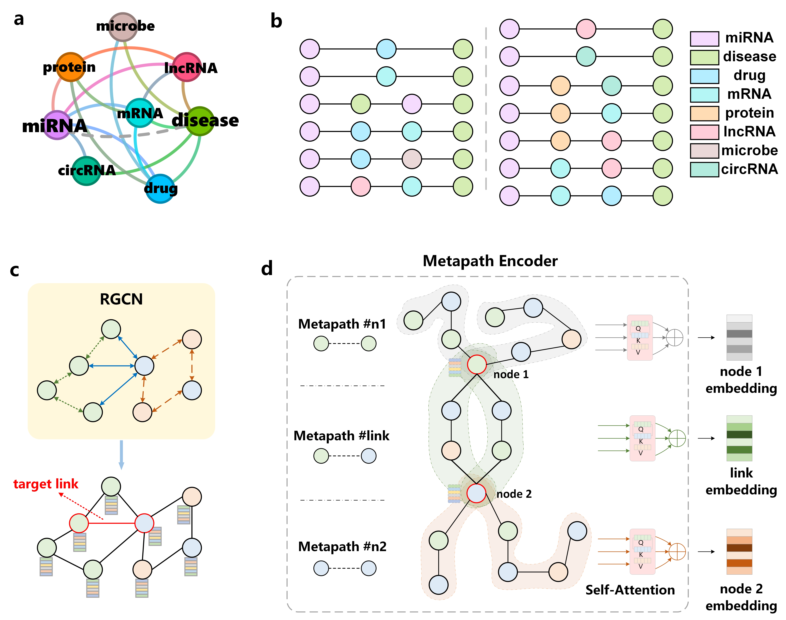

# CoupleMDA

This repository implements the heterogeneous graph link prediction model proposed in "CoupleMDA: Metapath-Induced Structural-Semantic Coupling Network for miRNA-Disease Association Prediction" (Under Review). The model introduces a novel relation-aware hierarchical attention mechanism for heterogeneous information fusion.



## Requirements
- Python ≥ 3.8
- PyTorch ≥ 2.1
- DGL ≥ 2.1
- numpy
- scikit-learn
- matplotlib

## Datasets
This experiment uses the standard dataset from Zou's biological entity heterogeneous graph dataset https://github.com/zht-code/HGTMDA.

Dataset structure:
```text
data/
├── info.dat       # Metadata file (node/relation type mappings)
├── link.dat       # Training edges
├── node.dat       # Node features and type information
└── link.dat.test  # Test edges
```

## Quick Start

### Training
```bash
python run_Zou.py --run-mode train
```

### Evaluation
```bash
python run_Zou.py --run-mode test
```
